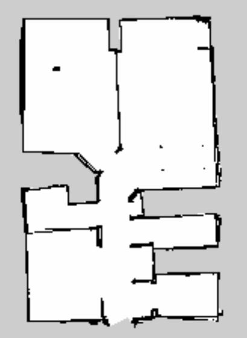

# Project 5 - Home Service Robot

## Description
This is the final project for the Udacity Robotics Software Engineering Nanodegree. A turtlebot is deployed in a custom gazebo environment (modelled after my apartment). The turtlebot is given a goal position that it navigates to using the `slam_gmapping` package. The `slam_gmapping` package was also used to generate the map of the environment used for navigation. The initial goal position is represented by a green square virtual object shown in Rviz. After picking up the virtual object, the robot navigates to a different goal position and drops off the virtual object.

## Packages
To implement this project several ROS packages are used:

### External Packages

`slam_gmapping`: This package is a wrapper around the [gmapping] (http://wiki.ros.org/gmapping) package. The package implements SLAM (simultaneous localization and mapping) using a mobile robot's LIDAR and pose data to generate an occupancy grid map. The SLAM algorithm implements a Ray-Blackwellized particle filter, in which each particle carries a map of the environment.

`turtlebot_gazebo`: This package contains the Turtlebot and world models. For this project a custom world was used instead of the standard demo world in the package.

`turtlebot_teleop`: This package can be used to manually move the turtlebot around using the keyboard. It was used with `slam_gmapping` to move through the environment and generate a map. 

`turtlebot_rviz_launchers`: This package contains Rviz configurations that are already subscribed to the required topics. This saves time compared to manually subscribing to the various topics each time Rviz is opened.

`navigation`: The [ROS navigation stack package](http://wiki.ros.org/navigation) takes in sensor data (LIDAR), odometry, map, and goal pose and outputs the velocity commands to navigate the robot to the goal. In order to navigate to a goal pose it must also localize the robot within the map.

### Custom Packages
`my_robot`: This package, created in [Project 2](https://github.com/SagarSaxena/Robotics-Nano-Degree/tree/master/Project2), contains the environment, modelled in Gazebo.

`pick_objects`: This package commands two goal poses to the `move_base` server, a "pick up zone" and a "drop off zone". It also displays a message to the console after the goal positions are reached. 

`add_markers`: This package published a `visualization_marker` topic, to represent the object (green square) being picked up and dropped off by the robot. It subscribes to the `amcl_pose` topic to determine when the robot has reached the marker/goal position.

## Results

**Shown above:** Visualization in Rviz. The robot can be seen navigating to two different goal positions and picking up and dropping off a virtual object (green square).


**Shown above:** Running the same script but visualizing the robot and environment in Gazebo.

## Install
```
$ git clone https://github.com/SagarSaxena/Home-Service-Robot.git
```

## Generating a Map
source the environment and launch the script:
```
$ cd ~/Home-Service-Robot/
$ source devel/setup.bash
$ cd src/scripts/
$ ./test_slam.sh
```
after mapping the environment open a terminal and save the map:
```
rosrun map_server map_saver
```
Note this will save two files, map.pgm and map.yaml in the current directory. Map.pgm is shown below


## Testing the navigation stack
source the environment and launch the script:
```
$ cd ~/Home-Service-Robot/
$ source devel/setup.bash
$ cd src/scripts/
$ ./test_navigation.sh
```
Use the `2D Nav Goal` button in Rviz to set goal positions and watch the robot navigate to them


## Run the full project
source the environment and launch the script:
```
$ cd ~/Home-Service-Robot/
$ source devel/setup.bash
$ cd src/scripts/
$ ./home_service.sh
```
The robot will autonomously navigate to a pick up position indicated by a square marker, hold position for 5 second to simulate a "pick up", and then navigate to a drop off position and drop off the marker. 

